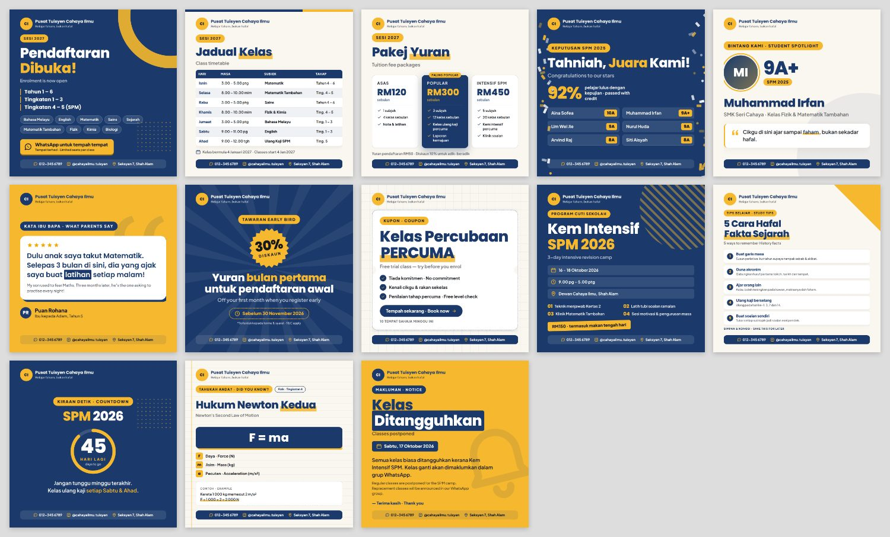

# Poster Studio: tuition centre marketing templates

13 ready-made, bilingual (BM + English) poster templates for a tuition centre's social media.
Edit the text in your browser and download a PNG sized for Instagram, Facebook, WhatsApp Status or TikTok.



## Quick start

1. Open **`marketing/index.html`** in Chrome or Edge (double-click it; no install, no internet needed).
2. Open **Jenama · Brand** on the right once and fill in your centre's name, logo, WhatsApp number, social handle and location. These appear on every poster.
3. Pick a template on the left, type your text, choose a size, then press **Muat turun PNG · Download**.

The browser remembers your edits. Use **Simpan fail · Save file** to keep a backup, or to move your work to another computer (**Buka fail · Load file**).

## Templates

| Category | Template | Use it for |
|---|---|---|
| Pendaftaran · Enrolment | `intake` Pendaftaran Dibuka | New intake: levels, subjects, WhatsApp call to action |
| | `timetable` Jadual Kelas | Weekly class schedule (any number of rows) |
| | `fees` Pakej Yuran | Price packages, with one highlighted as "Paling popular" |
| Keputusan · Results | `results` Keputusan Cemerlang | Exam results: headline stat + list of students and grades |
| | `spotlight` Bintang Pelajar | One student: photo, grade, school, quote |
| | `testimonial` Testimoni Ibu Bapa | Parent quote with stars and English translation |
| Promosi · Promos & events | `promo` Diskaun Early Bird | Discounts: big number in a badge, deadline, T&C |
| | `freetrial` Kelas Percubaan Percuma | Free-trial coupon with benefits and a "Book now" button |
| | `event` Kem / Program | Camps, workshops, holiday programmes: date, time, venue, agenda, price |
| Tips & info | `tips` Tips Belajar | Numbered study tips (good for saves and shares) |
| | `countdown` Kiraan Detik | "SPM: 45 hari lagi" exam countdown |
| | `quicknote` Nota Ringkas | "Did you know?" formula or fact card |
| Makluman · Notices | `notice` Makluman Umum | Closures, postponed classes, announcements |

Every template comes in three sizes:

| Size | Pixels | Where |
|---|---|---|
| 1:1 Square | 1080 × 1080 | Instagram / Facebook feed |
| 4:5 Portrait | 1080 × 1350 | Instagram feed (takes the most screen space) |
| 9:16 Story | 1080 × 1920 | IG/FB Story, WhatsApp Status, TikTok (keeps the top and bottom clear of app buttons) |

All 39 are pre-rendered in [`samples/`](samples/).

## Typing shortcuts

- `*perkataan*`: highlights a word in your accent colour
- New line = new item in list fields (subjects, tips, students…)
- `|` splits columns: `Aina Sofea | 10A`, `Isnin | 3.00 – 5.00 ptg | Matematik | Tahun 4 – 6`
- Fee packages: `Nama | Harga | Tempoh | ciri; ciri; ciri`. Start a line with `*` to make it the highlighted package.
- Leave a field empty to hide it.
- Text shrinks or grows automatically to fit, but shorter always reads better on a phone.

## Colours

Pick one of 8 palettes, or set your own **Primary** (dark: backgrounds, headings) and **Accent** (bright: highlights, badges).
Text colour on top of each is chosen automatically for contrast. Keep the primary dark and the accent bright.

## Batch mode: posts from a file (optional)

When you plan a week or month of posts, write them all into one JSON file and render every image in one go.
This also makes it easy to ask ChatGPT or Claude to write the copy: give it
[`examples/posts.example.json`](examples/posts.example.json) and the field names from `templates.js`, and it can return a ready-to-render file.

```bash
cd marketing
npm install
npx playwright install chromium
node render.js examples/posts.example.json   # images go to marketing/out/
node render.js                               # re-render all samples/
```

Each post takes `template`, `size` (`square`, `portrait`, `story` or `all`), an optional file `name`, and `values`.
Any field you leave out keeps the template's example text, so always check the result before posting.

## Files

| File | What it is |
|---|---|
| `index.html` | The editor |
| `brand.js` | Your default brand details and colour palettes; edit once |
| `templates.js` | All templates: fields, example text and layout. Add new templates here. |
| `poster-styles.js` | Poster design (CSS inside a JS file, so export also works when the page is opened from disk) |
| `editor.js`, `editor.css` | Editor behaviour and look |
| `render.js` | Batch renderer (needs Playwright) |
| `vendor/fonts.js` | Poppins + Plus Jakarta Sans fonts, embedded (SIL Open Font License, see `vendor/OFL-*.txt`) |

## Adding a template

Copy an existing entry in `templates.js`, give it a new `id`, and change its `fields` and `render`.
Add its styles to `poster-styles.js` under `.tpl-<id>`. Run `node render.js` to create its sample thumbnail.
Inline SVG shapes must use `fill`/`stroke="currentColor"` attributes (set `color` on the `<svg>`), or they lose their colour in the exported PNG.

## Troubleshooting

- **Fonts or layout look wrong in the downloaded PNG:** use Chrome or Edge. Safari and Firefox render exports less reliably.
- **Changes not remembered:** private/incognito windows don't keep storage. Use *Save file*.
- **Photo or logo too big:** uploads are shrunk automatically. PNG logos with a transparent background look best.
- **Before you post:** the example names, results, prices and dates are placeholders. Replace them with your own, and get consent before posting a student's name, photo or results.
